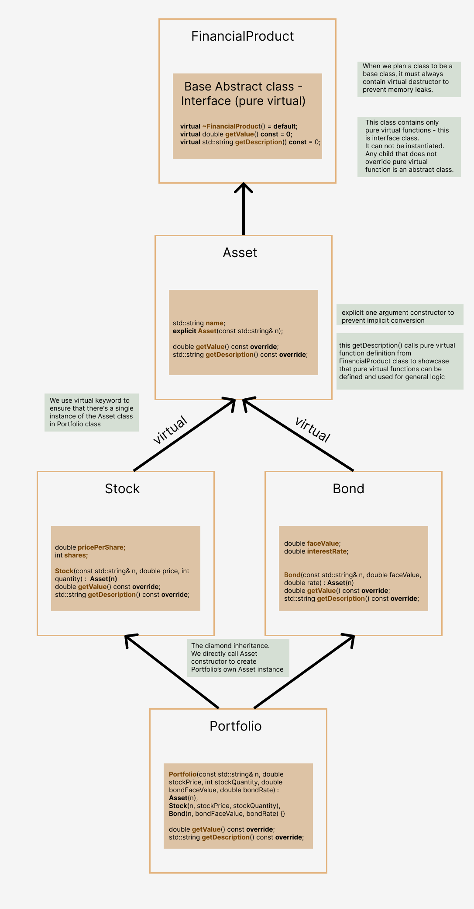

# financia lProducts Project

### This Financial Products Project is written in C++ and demonstrates concepts such as smart pointers, polymorphism, diamond inheritance, interface classes, and explicit constructors. 

### A SharedPtr template class manages shared memory through reference counting and supports both copy and move semantics for performance advantages. 

### The project defines a FinancialProduct interface with Asset, Stock, Bond, and composite Portfolio classes. 

### Each class implements value and description methods. The pure virtual function in FinancialProduct base class is given definition to provide general functionality. Runtime polymorphism is achieved via the virtual keyword for simplified instance management. 

### The main() function creates an inventory using std::unique_ptr and uses SharedPtr for shared resource ownership.

